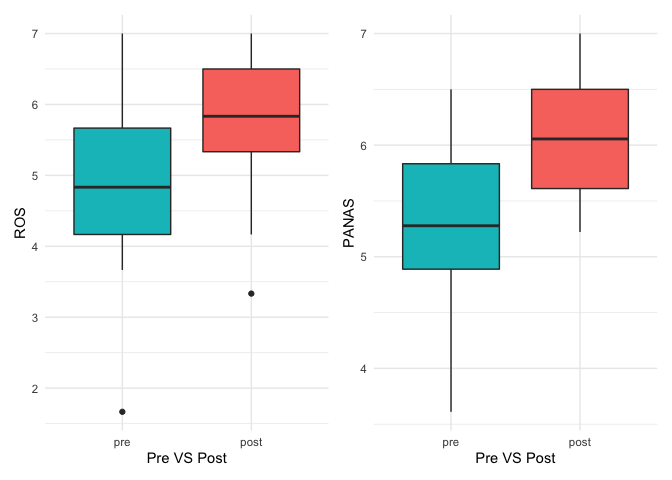

# Pre- and Post-Assessment

## Description

Total 58 entries (29 people respondend to pre-and post-survey) till Jan
2020

<!-- ```{r include=FALSE} -->

<!-- gui_pre_post <- read_csv(here::here("data/Pre_post_GUI_12Feb20.csv")) %>% -->

<!--   filter(include == "yes") %>% -->

<!--   mutate( -->

<!--     age = as.numeric(age), -->

<!--     gender = as_factor(gender), -->

<!--     race = as_factor(race), -->

<!--     program_today = as_factor(program_today) -->

<!--   ) %>% -->

<!--   filter(Please_type_your_assigned_numb != "16") %>% -->

<!--   mutate( -->

<!--     pos1 = as.numeric(pos1), -->

<!--     pos9 = as.numeric(pos9), -->

<!--     negative1_coded = as.numeric(negative1_coded), -->

<!--     pos2 = as.numeric(pos2), -->

<!--     pos3 = as.numeric(pos3), -->

<!--     negative2_coded = as.numeric(negative2_coded), -->

<!--     pos4 = as.numeric(pos4), -->

<!--     pos6 = as.numeric(pos6), -->

<!--     negative3_coded = as.numeric(negative3_coded), -->

<!--     pos5 = as.numeric(pos5), -->

<!--     pos7 = as.numeric(pos7), -->

<!--     negative4_coded = as.numeric(negative4_coded), -->

<!--     pos8 = as.numeric(pos8), -->

<!--     pos10 = as.numeric(pos10), -->

<!--     cns_1 = as.numeric(cns_1), -->

<!--     cns_2 = as.numeric(cns_2), -->

<!--     cns_3 = as.numeric(cns_3), -->

<!--     cns_4 = as.numeric(cns_4) -->

<!--   ) -->

<!-- ```  -->

<!-- ```{r include=FALSE} -->

<!-- # 2.2 create scales -->

<!-- scale.list2 <- -->

<!--   list( -->

<!--     ROS = c("ros1", "ros2", "ros3", "ros4", "ros5", "ros6"), -->

<!--     PANAS = c( -->

<!--       "panas_1_coded", "panas_2", "panas_3_coded", "panas_4", "panas_5_coded", "panas_6", -->

<!--       "panas_7_coded", "panas_8", "panas_9_coded", "panas_10", "panas_11_coded", "panas_12", -->

<!--       "panas_13_coded", "panas_14", "panas_15_coded", "panas_16", "panas_17_coded", "panas_18" -->

<!--     ), -->

<!--     POS = c( -->

<!--       "pos1", "pos9", "negative1_coded", "pos2", "pos3", "negative2_coded", "pos4", "pos6", -->

<!--       "negative3_coded", "pos5", "pos7", "negative4_coded", "pos8", "pos10" -->

<!--     ), -->

<!--     CNS = c("cns_1", "cns_2", "cns_3", "cns_4") -->

<!--   ) -->

<!-- ``` -->

<!-- ```{r include=FALSE} -->

<!-- library(psych) -->

<!-- my.scales <- scoreItems(scale.list2, gui_pre_post) -->

<!-- ``` -->

<!-- ```{r include=FALSE} -->

<!-- ## Cronbach's Alpha -->

<!-- library(dplyr) -->

<!-- dfRosscore <- select(gui_pre_post, "ros1", "ros2", "ros3", "ros4", "ros5", "ros6") -->

<!-- dfPANASscore <- select(gui_pre_post, "panas_1_coded", "panas_2", "panas_3_coded", "panas_4", "panas_5_coded", "panas_6", "panas_7_coded", "panas_8", "panas_9_coded", "panas_10", "panas_11_coded", "panas_12", "panas_13_coded", "panas_14", "panas_15_coded", "panas_16", "panas_17_coded", "panas_18") -->

<!-- dfPOSscore <- select(gui_pre_post, "pos1", "pos9", "negative1_coded", "pos2", "pos3", "negative2_coded", "pos4", "pos6", "negative3_coded", "pos5", "pos7", "negative4_coded", "pos8", "pos10") -->

<!-- dfCNSscore <- select(gui_pre_post, "cns_1", "cns_2", "cns_3", "cns_4") -->

<!-- ``` -->

<!-- ```{r include=FALSE} -->

<!-- alpha(dfRosscore) -->

<!-- alpha(dfPANASscore) -->

<!-- ``` -->

<!-- ```{r include=FALSE} -->

<!-- my.scores <- my.scales$scores -->

<!-- describe(my.scores) -->

<!-- ``` -->

<!-- ```{r include=FALSE} -->

<!-- dfscores <- data.frame(my.scores) -->

<!-- data_pre_post_scales <- cbind(gui_pre_post, dfscores) -->

<!-- ``` -->

## Decrtiptive statistics

Both Restoration Outcome Scale (`ROS`) and Positive and Negative Affect
Schedule (`PANAS`) have good Cronbach’s alpha, ranging from .88 to .90 (
**good internal consistency**). The result of Sharpiro test shows that
Age and PANAS follow **a normal distribution**.

<!--html_preserve-->

<style>html {
  font-family: -apple-system, BlinkMacSystemFont, 'Segoe UI', Roboto, Oxygen, Ubuntu, Cantarell, 'Helvetica Neue', 'Fira Sans', 'Droid Sans', Arial, sans-serif;
}

#esbelgtnxz .gt_table {
  display: table;
  border-collapse: collapse;
  margin-left: auto;
  margin-right: auto;
  color: #333333;
  font-size: 16px;
  background-color: #FFFFFF;
  width: auto;
  border-top-style: solid;
  border-top-width: 2px;
  border-top-color: #A8A8A8;
  border-right-style: none;
  border-right-width: 2px;
  border-right-color: #D3D3D3;
  border-bottom-style: solid;
  border-bottom-width: 2px;
  border-bottom-color: #A8A8A8;
  border-left-style: none;
  border-left-width: 2px;
  border-left-color: #D3D3D3;
}

#esbelgtnxz .gt_heading {
  background-color: #FFFFFF;
  text-align: center;
  border-bottom-color: #FFFFFF;
  border-left-style: none;
  border-left-width: 1px;
  border-left-color: #D3D3D3;
  border-right-style: none;
  border-right-width: 1px;
  border-right-color: #D3D3D3;
}

#esbelgtnxz .gt_title {
  color: #333333;
  font-size: 125%;
  font-weight: initial;
  padding-top: 4px;
  padding-bottom: 4px;
  border-bottom-color: #FFFFFF;
  border-bottom-width: 0;
}

#esbelgtnxz .gt_subtitle {
  color: #333333;
  font-size: 85%;
  font-weight: initial;
  padding-top: 0;
  padding-bottom: 4px;
  border-top-color: #FFFFFF;
  border-top-width: 0;
}

#esbelgtnxz .gt_bottom_border {
  border-bottom-style: solid;
  border-bottom-width: 2px;
  border-bottom-color: #D3D3D3;
}

#esbelgtnxz .gt_col_headings {
  border-top-style: solid;
  border-top-width: 2px;
  border-top-color: #D3D3D3;
  border-bottom-style: solid;
  border-bottom-width: 2px;
  border-bottom-color: #D3D3D3;
  border-left-style: none;
  border-left-width: 1px;
  border-left-color: #D3D3D3;
  border-right-style: none;
  border-right-width: 1px;
  border-right-color: #D3D3D3;
}

#esbelgtnxz .gt_col_heading {
  color: #333333;
  background-color: #FFFFFF;
  font-size: 100%;
  font-weight: normal;
  text-transform: inherit;
  border-left-style: none;
  border-left-width: 1px;
  border-left-color: #D3D3D3;
  border-right-style: none;
  border-right-width: 1px;
  border-right-color: #D3D3D3;
  vertical-align: bottom;
  padding-top: 5px;
  padding-bottom: 6px;
  padding-left: 5px;
  padding-right: 5px;
  overflow-x: hidden;
}

#esbelgtnxz .gt_column_spanner_outer {
  color: #333333;
  background-color: #FFFFFF;
  font-size: 100%;
  font-weight: normal;
  text-transform: inherit;
  padding-top: 0;
  padding-bottom: 0;
  padding-left: 4px;
  padding-right: 4px;
}

#esbelgtnxz .gt_column_spanner_outer:first-child {
  padding-left: 0;
}

#esbelgtnxz .gt_column_spanner_outer:last-child {
  padding-right: 0;
}

#esbelgtnxz .gt_column_spanner {
  border-bottom-style: solid;
  border-bottom-width: 2px;
  border-bottom-color: #D3D3D3;
  vertical-align: bottom;
  padding-top: 5px;
  padding-bottom: 6px;
  overflow-x: hidden;
  display: inline-block;
  width: 100%;
}

#esbelgtnxz .gt_group_heading {
  padding: 8px;
  color: #333333;
  background-color: #FFFFFF;
  font-size: 100%;
  font-weight: initial;
  text-transform: inherit;
  border-top-style: solid;
  border-top-width: 2px;
  border-top-color: #D3D3D3;
  border-bottom-style: solid;
  border-bottom-width: 2px;
  border-bottom-color: #D3D3D3;
  border-left-style: none;
  border-left-width: 1px;
  border-left-color: #D3D3D3;
  border-right-style: none;
  border-right-width: 1px;
  border-right-color: #D3D3D3;
  vertical-align: middle;
}

#esbelgtnxz .gt_empty_group_heading {
  padding: 0.5px;
  color: #333333;
  background-color: #FFFFFF;
  font-size: 100%;
  font-weight: initial;
  border-top-style: solid;
  border-top-width: 2px;
  border-top-color: #D3D3D3;
  border-bottom-style: solid;
  border-bottom-width: 2px;
  border-bottom-color: #D3D3D3;
  vertical-align: middle;
}

#esbelgtnxz .gt_striped {
  background-color: rgba(128, 128, 128, 0.05);
}

#esbelgtnxz .gt_from_md > :first-child {
  margin-top: 0;
}

#esbelgtnxz .gt_from_md > :last-child {
  margin-bottom: 0;
}

#esbelgtnxz .gt_row {
  padding-top: 8px;
  padding-bottom: 8px;
  padding-left: 5px;
  padding-right: 5px;
  margin: 10px;
  border-top-style: solid;
  border-top-width: 1px;
  border-top-color: #D3D3D3;
  border-left-style: none;
  border-left-width: 1px;
  border-left-color: #D3D3D3;
  border-right-style: none;
  border-right-width: 1px;
  border-right-color: #D3D3D3;
  vertical-align: middle;
  overflow-x: hidden;
}

#esbelgtnxz .gt_stub {
  color: #333333;
  background-color: #FFFFFF;
  font-size: 100%;
  font-weight: initial;
  text-transform: inherit;
  border-right-style: solid;
  border-right-width: 2px;
  border-right-color: #D3D3D3;
  padding-left: 12px;
}

#esbelgtnxz .gt_summary_row {
  color: #333333;
  background-color: #FFFFFF;
  text-transform: inherit;
  padding-top: 8px;
  padding-bottom: 8px;
  padding-left: 5px;
  padding-right: 5px;
}

#esbelgtnxz .gt_first_summary_row {
  padding-top: 8px;
  padding-bottom: 8px;
  padding-left: 5px;
  padding-right: 5px;
  border-top-style: solid;
  border-top-width: 2px;
  border-top-color: #D3D3D3;
}

#esbelgtnxz .gt_grand_summary_row {
  color: #333333;
  background-color: #FFFFFF;
  text-transform: inherit;
  padding-top: 8px;
  padding-bottom: 8px;
  padding-left: 5px;
  padding-right: 5px;
}

#esbelgtnxz .gt_first_grand_summary_row {
  padding-top: 8px;
  padding-bottom: 8px;
  padding-left: 5px;
  padding-right: 5px;
  border-top-style: double;
  border-top-width: 6px;
  border-top-color: #D3D3D3;
}

#esbelgtnxz .gt_table_body {
  border-top-style: solid;
  border-top-width: 2px;
  border-top-color: #D3D3D3;
  border-bottom-style: solid;
  border-bottom-width: 2px;
  border-bottom-color: #D3D3D3;
}

#esbelgtnxz .gt_footnotes {
  color: #333333;
  background-color: #FFFFFF;
  border-bottom-style: none;
  border-bottom-width: 2px;
  border-bottom-color: #D3D3D3;
  border-left-style: none;
  border-left-width: 2px;
  border-left-color: #D3D3D3;
  border-right-style: none;
  border-right-width: 2px;
  border-right-color: #D3D3D3;
}

#esbelgtnxz .gt_footnote {
  margin: 0px;
  font-size: 90%;
  padding: 4px;
}

#esbelgtnxz .gt_sourcenotes {
  color: #333333;
  background-color: #FFFFFF;
  border-bottom-style: none;
  border-bottom-width: 2px;
  border-bottom-color: #D3D3D3;
  border-left-style: none;
  border-left-width: 2px;
  border-left-color: #D3D3D3;
  border-right-style: none;
  border-right-width: 2px;
  border-right-color: #D3D3D3;
}

#esbelgtnxz .gt_sourcenote {
  font-size: 90%;
  padding: 4px;
}

#esbelgtnxz .gt_left {
  text-align: left;
}

#esbelgtnxz .gt_center {
  text-align: center;
}

#esbelgtnxz .gt_right {
  text-align: right;
  font-variant-numeric: tabular-nums;
}

#esbelgtnxz .gt_font_normal {
  font-weight: normal;
}

#esbelgtnxz .gt_font_bold {
  font-weight: bold;
}

#esbelgtnxz .gt_font_italic {
  font-style: italic;
}

#esbelgtnxz .gt_super {
  font-size: 65%;
}

#esbelgtnxz .gt_footnote_marks {
  font-style: italic;
  font-size: 65%;
}
</style>

<div id="esbelgtnxz" style="overflow-x:auto;overflow-y:auto;width:auto;height:auto;">

<table class="gt_table">

<thead class="gt_header">

<tr>

<th colspan="16" class="gt_heading gt_title gt_font_normal" style>

Descriptive Statistics (pre-post survey)

</th>

</tr>

<tr>

<th colspan="16" class="gt_heading gt_subtitle gt_font_normal gt_bottom_border" style>

</th>

</tr>

</thead>

<thead class="gt_col_headings">

<tr>

<th class="gt_col_heading gt_columns_bottom_border gt_center" rowspan="1" colspan="1">

vars

</th>

<th class="gt_col_heading gt_columns_bottom_border gt_center" rowspan="1" colspan="1">

variables

</th>

<th class="gt_col_heading gt_columns_bottom_border gt_center" rowspan="1" colspan="1">

n

</th>

<th class="gt_col_heading gt_columns_bottom_border gt_center" rowspan="1" colspan="1">

mean

</th>

<th class="gt_col_heading gt_columns_bottom_border gt_center" rowspan="1" colspan="1">

sd

</th>

<th class="gt_col_heading gt_columns_bottom_border gt_center" rowspan="1" colspan="1">

median

</th>

<th class="gt_col_heading gt_columns_bottom_border gt_center" rowspan="1" colspan="1">

trimmed

</th>

<th class="gt_col_heading gt_columns_bottom_border gt_center" rowspan="1" colspan="1">

mad

</th>

<th class="gt_col_heading gt_columns_bottom_border gt_center" rowspan="1" colspan="1">

min

</th>

<th class="gt_col_heading gt_columns_bottom_border gt_center" rowspan="1" colspan="1">

max

</th>

<th class="gt_col_heading gt_columns_bottom_border gt_center" rowspan="1" colspan="1">

range

</th>

<th class="gt_col_heading gt_columns_bottom_border gt_center" rowspan="1" colspan="1">

skew

</th>

<th class="gt_col_heading gt_columns_bottom_border gt_center" rowspan="1" colspan="1">

kurtosis

</th>

<th class="gt_col_heading gt_columns_bottom_border gt_center" rowspan="1" colspan="1">

se

</th>

<th class="gt_col_heading gt_columns_bottom_border gt_center" rowspan="1" colspan="1">

Cronbachs\_alpha

</th>

<th class="gt_col_heading gt_columns_bottom_border gt_center" rowspan="1" colspan="1">

shapiro\_test

</th>

</tr>

</thead>

<tbody class="gt_table_body">

<tr>

<td class="gt_row gt_center">

1

</td>

<td class="gt_row gt_center">

Age

</td>

<td class="gt_row gt_center">

45

</td>

<td class="gt_row gt_center">

35.71

</td>

<td class="gt_row gt_center">

9.37

</td>

<td class="gt_row gt_center">

34.00

</td>

<td class="gt_row gt_center">

35.59

</td>

<td class="gt_row gt_center">

10.38

</td>

<td class="gt_row gt_center">

18.0

</td>

<td class="gt_row gt_center">

68.0

</td>

<td class="gt_row gt_center">

50.00

</td>

<td class="gt_row gt_center">

0.59

</td>

<td class="gt_row gt_center">

1.41

</td>

<td class="gt_row gt_center">

1.40

</td>

<td class="gt_row gt_center">

NA

</td>

<td class="gt_row gt_center">

0.059

</td>

</tr>

<tr>

<td class="gt_row gt_center">

2

</td>

<td class="gt_row gt_center">

Restoration Outcome

</td>

<td class="gt_row gt_center">

58

</td>

<td class="gt_row gt_center">

5.36

</td>

<td class="gt_row gt_center">

1.11

</td>

<td class="gt_row gt_center">

5.58

</td>

<td class="gt_row gt_center">

5.40

</td>

<td class="gt_row gt_center">

1.11

</td>

<td class="gt_row gt_center">

1.7

</td>

<td class="gt_row gt_center">

7.0

</td>

<td class="gt_row gt_center">

5.33

</td>

<td class="gt_row gt_center">

−0.54

</td>

<td class="gt_row gt_center">

0.37

</td>

<td class="gt_row gt_center">

0.15

</td>

<td class="gt_row gt_center">

0.88

</td>

<td class="gt_row gt_center">

0.018

</td>

</tr>

<tr>

<td class="gt_row gt_center">

3

</td>

<td class="gt_row gt_center">

Positive and Negative Affect Schedule

</td>

<td class="gt_row gt_center">

58

</td>

<td class="gt_row gt_center">

5.65

</td>

<td class="gt_row gt_center">

0.81

</td>

<td class="gt_row gt_center">

5.72

</td>

<td class="gt_row gt_center">

5.71

</td>

<td class="gt_row gt_center">

0.74

</td>

<td class="gt_row gt_center">

3.6

</td>

<td class="gt_row gt_center">

7.0

</td>

<td class="gt_row gt_center">

3.39

</td>

<td class="gt_row gt_center">

−0.61

</td>

<td class="gt_row gt_center">

0.04

</td>

<td class="gt_row gt_center">

0.11

</td>

<td class="gt_row gt_center">

0.9

</td>

<td class="gt_row gt_center">

0.052

</td>

</tr>

</tbody>

</table>

</div>

<!--/html_preserve-->

## Correlation Test

  - It’s observed that Restoration Outcome Scale (`ROS`) and Positive
    and Negative Affect Schedule (`PANAS`) have **a strong positive
    correlation** (r=0.722, Spearman): Those who **fell the higher sense
    of positive emotions** also feel the **higher sense of
    restorations**.

  - **Perceived Restorativeness Scale (`POS`)** also **shows the
    signficant correlation** with **the nature connection (`CNS`)**:
    those who have a higher sense of nature connection feels higher
    perceived restorations

<!-- end list -->

    ## corrplot 0.84 loaded

<!-- -->

## Significance Test (t-test and Wilcoxon Test ): Pre VS Post

  - As preliminary analyses, we assessed whether there were **any
    differences** between **pre-test and post-test groups** in terms of
    the respective psychological measures.

  - We conducted the **Welch Two Sample t-test** on `PANAS` and
    **Wilcoxon Signed-rank test** on `ROS`.

  - **Statistically significant differences** were observed in **both
    scales**. Cohen’s d was estimated at **0.51 and 1.002**, which are
    **medium to large effect** based on the Cohen’s guidelines (1992).

  - This study identified that **those who engaged in GUI programs**
    feel **more restored and more positive emmotions** right **after
    attending a program**.

  - Going forward, **program-wise analysis** needs to be conducted to
    see if **attending a particular program** shows **different ROS and
    PANAS** compared to those who attend a different program. For this,
    we need further data collections (minimum of 20 participants in each
    program).

<!--html_preserve-->

<style>html {
  font-family: -apple-system, BlinkMacSystemFont, 'Segoe UI', Roboto, Oxygen, Ubuntu, Cantarell, 'Helvetica Neue', 'Fira Sans', 'Droid Sans', Arial, sans-serif;
}

#jvqvqyglrn .gt_table {
  display: table;
  border-collapse: collapse;
  margin-left: auto;
  margin-right: auto;
  color: #333333;
  font-size: 16px;
  background-color: #FFFFFF;
  width: auto;
  border-top-style: solid;
  border-top-width: 2px;
  border-top-color: #A8A8A8;
  border-right-style: none;
  border-right-width: 2px;
  border-right-color: #D3D3D3;
  border-bottom-style: solid;
  border-bottom-width: 2px;
  border-bottom-color: #A8A8A8;
  border-left-style: none;
  border-left-width: 2px;
  border-left-color: #D3D3D3;
}

#jvqvqyglrn .gt_heading {
  background-color: #FFFFFF;
  text-align: center;
  border-bottom-color: #FFFFFF;
  border-left-style: none;
  border-left-width: 1px;
  border-left-color: #D3D3D3;
  border-right-style: none;
  border-right-width: 1px;
  border-right-color: #D3D3D3;
}

#jvqvqyglrn .gt_title {
  color: #333333;
  font-size: 125%;
  font-weight: initial;
  padding-top: 4px;
  padding-bottom: 4px;
  border-bottom-color: #FFFFFF;
  border-bottom-width: 0;
}

#jvqvqyglrn .gt_subtitle {
  color: #333333;
  font-size: 85%;
  font-weight: initial;
  padding-top: 0;
  padding-bottom: 4px;
  border-top-color: #FFFFFF;
  border-top-width: 0;
}

#jvqvqyglrn .gt_bottom_border {
  border-bottom-style: solid;
  border-bottom-width: 2px;
  border-bottom-color: #D3D3D3;
}

#jvqvqyglrn .gt_col_headings {
  border-top-style: solid;
  border-top-width: 2px;
  border-top-color: #D3D3D3;
  border-bottom-style: solid;
  border-bottom-width: 2px;
  border-bottom-color: #D3D3D3;
  border-left-style: none;
  border-left-width: 1px;
  border-left-color: #D3D3D3;
  border-right-style: none;
  border-right-width: 1px;
  border-right-color: #D3D3D3;
}

#jvqvqyglrn .gt_col_heading {
  color: #333333;
  background-color: #FFFFFF;
  font-size: 100%;
  font-weight: normal;
  text-transform: inherit;
  border-left-style: none;
  border-left-width: 1px;
  border-left-color: #D3D3D3;
  border-right-style: none;
  border-right-width: 1px;
  border-right-color: #D3D3D3;
  vertical-align: bottom;
  padding-top: 5px;
  padding-bottom: 6px;
  padding-left: 5px;
  padding-right: 5px;
  overflow-x: hidden;
}

#jvqvqyglrn .gt_column_spanner_outer {
  color: #333333;
  background-color: #FFFFFF;
  font-size: 100%;
  font-weight: normal;
  text-transform: inherit;
  padding-top: 0;
  padding-bottom: 0;
  padding-left: 4px;
  padding-right: 4px;
}

#jvqvqyglrn .gt_column_spanner_outer:first-child {
  padding-left: 0;
}

#jvqvqyglrn .gt_column_spanner_outer:last-child {
  padding-right: 0;
}

#jvqvqyglrn .gt_column_spanner {
  border-bottom-style: solid;
  border-bottom-width: 2px;
  border-bottom-color: #D3D3D3;
  vertical-align: bottom;
  padding-top: 5px;
  padding-bottom: 6px;
  overflow-x: hidden;
  display: inline-block;
  width: 100%;
}

#jvqvqyglrn .gt_group_heading {
  padding: 8px;
  color: #333333;
  background-color: #FFFFFF;
  font-size: 100%;
  font-weight: initial;
  text-transform: inherit;
  border-top-style: solid;
  border-top-width: 2px;
  border-top-color: #D3D3D3;
  border-bottom-style: solid;
  border-bottom-width: 2px;
  border-bottom-color: #D3D3D3;
  border-left-style: none;
  border-left-width: 1px;
  border-left-color: #D3D3D3;
  border-right-style: none;
  border-right-width: 1px;
  border-right-color: #D3D3D3;
  vertical-align: middle;
}

#jvqvqyglrn .gt_empty_group_heading {
  padding: 0.5px;
  color: #333333;
  background-color: #FFFFFF;
  font-size: 100%;
  font-weight: initial;
  border-top-style: solid;
  border-top-width: 2px;
  border-top-color: #D3D3D3;
  border-bottom-style: solid;
  border-bottom-width: 2px;
  border-bottom-color: #D3D3D3;
  vertical-align: middle;
}

#jvqvqyglrn .gt_striped {
  background-color: rgba(128, 128, 128, 0.05);
}

#jvqvqyglrn .gt_from_md > :first-child {
  margin-top: 0;
}

#jvqvqyglrn .gt_from_md > :last-child {
  margin-bottom: 0;
}

#jvqvqyglrn .gt_row {
  padding-top: 8px;
  padding-bottom: 8px;
  padding-left: 5px;
  padding-right: 5px;
  margin: 10px;
  border-top-style: solid;
  border-top-width: 1px;
  border-top-color: #D3D3D3;
  border-left-style: none;
  border-left-width: 1px;
  border-left-color: #D3D3D3;
  border-right-style: none;
  border-right-width: 1px;
  border-right-color: #D3D3D3;
  vertical-align: middle;
  overflow-x: hidden;
}

#jvqvqyglrn .gt_stub {
  color: #333333;
  background-color: #FFFFFF;
  font-size: 100%;
  font-weight: initial;
  text-transform: inherit;
  border-right-style: solid;
  border-right-width: 2px;
  border-right-color: #D3D3D3;
  padding-left: 12px;
}

#jvqvqyglrn .gt_summary_row {
  color: #333333;
  background-color: #FFFFFF;
  text-transform: inherit;
  padding-top: 8px;
  padding-bottom: 8px;
  padding-left: 5px;
  padding-right: 5px;
}

#jvqvqyglrn .gt_first_summary_row {
  padding-top: 8px;
  padding-bottom: 8px;
  padding-left: 5px;
  padding-right: 5px;
  border-top-style: solid;
  border-top-width: 2px;
  border-top-color: #D3D3D3;
}

#jvqvqyglrn .gt_grand_summary_row {
  color: #333333;
  background-color: #FFFFFF;
  text-transform: inherit;
  padding-top: 8px;
  padding-bottom: 8px;
  padding-left: 5px;
  padding-right: 5px;
}

#jvqvqyglrn .gt_first_grand_summary_row {
  padding-top: 8px;
  padding-bottom: 8px;
  padding-left: 5px;
  padding-right: 5px;
  border-top-style: double;
  border-top-width: 6px;
  border-top-color: #D3D3D3;
}

#jvqvqyglrn .gt_table_body {
  border-top-style: solid;
  border-top-width: 2px;
  border-top-color: #D3D3D3;
  border-bottom-style: solid;
  border-bottom-width: 2px;
  border-bottom-color: #D3D3D3;
}

#jvqvqyglrn .gt_footnotes {
  color: #333333;
  background-color: #FFFFFF;
  border-bottom-style: none;
  border-bottom-width: 2px;
  border-bottom-color: #D3D3D3;
  border-left-style: none;
  border-left-width: 2px;
  border-left-color: #D3D3D3;
  border-right-style: none;
  border-right-width: 2px;
  border-right-color: #D3D3D3;
}

#jvqvqyglrn .gt_footnote {
  margin: 0px;
  font-size: 90%;
  padding: 4px;
}

#jvqvqyglrn .gt_sourcenotes {
  color: #333333;
  background-color: #FFFFFF;
  border-bottom-style: none;
  border-bottom-width: 2px;
  border-bottom-color: #D3D3D3;
  border-left-style: none;
  border-left-width: 2px;
  border-left-color: #D3D3D3;
  border-right-style: none;
  border-right-width: 2px;
  border-right-color: #D3D3D3;
}

#jvqvqyglrn .gt_sourcenote {
  font-size: 90%;
  padding: 4px;
}

#jvqvqyglrn .gt_left {
  text-align: left;
}

#jvqvqyglrn .gt_center {
  text-align: center;
}

#jvqvqyglrn .gt_right {
  text-align: right;
  font-variant-numeric: tabular-nums;
}

#jvqvqyglrn .gt_font_normal {
  font-weight: normal;
}

#jvqvqyglrn .gt_font_bold {
  font-weight: bold;
}

#jvqvqyglrn .gt_font_italic {
  font-style: italic;
}

#jvqvqyglrn .gt_super {
  font-size: 65%;
}

#jvqvqyglrn .gt_footnote_marks {
  font-style: italic;
  font-size: 65%;
}
</style>

<div id="jvqvqyglrn" style="overflow-x:auto;overflow-y:auto;width:auto;height:auto;">

<table class="gt_table">

<thead class="gt_header">

<tr>

<th colspan="8" class="gt_heading gt_title gt_font_normal" style>

Summary of Test Statistics: Pre-and-post Survey

</th>

</tr>

<tr>

<th colspan="8" class="gt_heading gt_subtitle gt_font_normal gt_bottom_border" style>

</th>

</tr>

</thead>

<thead class="gt_col_headings">

<tr>

<th class="gt_col_heading gt_columns_bottom_border gt_center" rowspan="1" colspan="1">

vars

</th>

<th class="gt_col_heading gt_columns_bottom_border gt_center" rowspan="1" colspan="1">

scales

</th>

<th class="gt_col_heading gt_columns_bottom_border gt_center" rowspan="1" colspan="1">

Cronbachs\_alpha

</th>

<th class="gt_col_heading gt_columns_bottom_border gt_center" rowspan="1" colspan="1">

shapiro\_test

</th>

<th class="gt_col_heading gt_columns_bottom_border gt_center" rowspan="1" colspan="1">

pre\_means

</th>

<th class="gt_col_heading gt_columns_bottom_border gt_center" rowspan="1" colspan="1">

post\_means

</th>

<th class="gt_col_heading gt_columns_bottom_border gt_center" rowspan="1" colspan="1">

test\_statistics

</th>

<th class="gt_col_heading gt_columns_bottom_border gt_center" rowspan="1" colspan="1">

effect\_size

</th>

</tr>

</thead>

<tbody class="gt_table_body">

<tr>

<td class="gt_row gt_center">

1

</td>

<td class="gt_row gt_center">

ROS

</td>

<td class="gt_row gt_center">

0.88

</td>

<td class="gt_row gt_center">

0.018

</td>

<td class="gt_row gt_center">

4.94

</td>

<td class="gt_row gt_center">

5.78

</td>

<td class="gt_row gt_center">

p \< 0.01

</td>

<td class="gt_row gt_center">

0.51700

</td>

</tr>

<tr>

<td class="gt_row gt_center">

2

</td>

<td class="gt_row gt_center">

PANAS

</td>

<td class="gt_row gt_center">

0.90

</td>

<td class="gt_row gt_center">

0.052

</td>

<td class="gt_row gt_center">

5.20

</td>

<td class="gt_row gt_center">

6.10

</td>

<td class="gt_row gt_center">

p \< 0.001

</td>

<td class="gt_row gt_center">

1.31965

</td>

</tr>

</tbody>

<tfoot class="gt_sourcenotes">

<tr>

<td class="gt_sourcenote" colspan="8">

\*t-test for PANAS, and Wilcoxon test for ROS

</td>

</tr>

</tfoot>

</table>

</div>

<!--/html_preserve-->

<!--html_preserve-->

<style>html {
  font-family: -apple-system, BlinkMacSystemFont, 'Segoe UI', Roboto, Oxygen, Ubuntu, Cantarell, 'Helvetica Neue', 'Fira Sans', 'Droid Sans', Arial, sans-serif;
}

#outkxdmsoi .gt_table {
  display: table;
  border-collapse: collapse;
  margin-left: auto;
  margin-right: auto;
  color: #333333;
  font-size: 16px;
  background-color: #FFFFFF;
  width: auto;
  border-top-style: solid;
  border-top-width: 2px;
  border-top-color: #A8A8A8;
  border-right-style: none;
  border-right-width: 2px;
  border-right-color: #D3D3D3;
  border-bottom-style: solid;
  border-bottom-width: 2px;
  border-bottom-color: #A8A8A8;
  border-left-style: none;
  border-left-width: 2px;
  border-left-color: #D3D3D3;
}

#outkxdmsoi .gt_heading {
  background-color: #FFFFFF;
  text-align: center;
  border-bottom-color: #FFFFFF;
  border-left-style: none;
  border-left-width: 1px;
  border-left-color: #D3D3D3;
  border-right-style: none;
  border-right-width: 1px;
  border-right-color: #D3D3D3;
}

#outkxdmsoi .gt_title {
  color: #333333;
  font-size: 125%;
  font-weight: initial;
  padding-top: 4px;
  padding-bottom: 4px;
  border-bottom-color: #FFFFFF;
  border-bottom-width: 0;
}

#outkxdmsoi .gt_subtitle {
  color: #333333;
  font-size: 85%;
  font-weight: initial;
  padding-top: 0;
  padding-bottom: 4px;
  border-top-color: #FFFFFF;
  border-top-width: 0;
}

#outkxdmsoi .gt_bottom_border {
  border-bottom-style: solid;
  border-bottom-width: 2px;
  border-bottom-color: #D3D3D3;
}

#outkxdmsoi .gt_col_headings {
  border-top-style: solid;
  border-top-width: 2px;
  border-top-color: #D3D3D3;
  border-bottom-style: solid;
  border-bottom-width: 2px;
  border-bottom-color: #D3D3D3;
  border-left-style: none;
  border-left-width: 1px;
  border-left-color: #D3D3D3;
  border-right-style: none;
  border-right-width: 1px;
  border-right-color: #D3D3D3;
}

#outkxdmsoi .gt_col_heading {
  color: #333333;
  background-color: #FFFFFF;
  font-size: 100%;
  font-weight: normal;
  text-transform: inherit;
  border-left-style: none;
  border-left-width: 1px;
  border-left-color: #D3D3D3;
  border-right-style: none;
  border-right-width: 1px;
  border-right-color: #D3D3D3;
  vertical-align: bottom;
  padding-top: 5px;
  padding-bottom: 6px;
  padding-left: 5px;
  padding-right: 5px;
  overflow-x: hidden;
}

#outkxdmsoi .gt_column_spanner_outer {
  color: #333333;
  background-color: #FFFFFF;
  font-size: 100%;
  font-weight: normal;
  text-transform: inherit;
  padding-top: 0;
  padding-bottom: 0;
  padding-left: 4px;
  padding-right: 4px;
}

#outkxdmsoi .gt_column_spanner_outer:first-child {
  padding-left: 0;
}

#outkxdmsoi .gt_column_spanner_outer:last-child {
  padding-right: 0;
}

#outkxdmsoi .gt_column_spanner {
  border-bottom-style: solid;
  border-bottom-width: 2px;
  border-bottom-color: #D3D3D3;
  vertical-align: bottom;
  padding-top: 5px;
  padding-bottom: 6px;
  overflow-x: hidden;
  display: inline-block;
  width: 100%;
}

#outkxdmsoi .gt_group_heading {
  padding: 8px;
  color: #333333;
  background-color: #FFFFFF;
  font-size: 100%;
  font-weight: initial;
  text-transform: inherit;
  border-top-style: solid;
  border-top-width: 2px;
  border-top-color: #D3D3D3;
  border-bottom-style: solid;
  border-bottom-width: 2px;
  border-bottom-color: #D3D3D3;
  border-left-style: none;
  border-left-width: 1px;
  border-left-color: #D3D3D3;
  border-right-style: none;
  border-right-width: 1px;
  border-right-color: #D3D3D3;
  vertical-align: middle;
}

#outkxdmsoi .gt_empty_group_heading {
  padding: 0.5px;
  color: #333333;
  background-color: #FFFFFF;
  font-size: 100%;
  font-weight: initial;
  border-top-style: solid;
  border-top-width: 2px;
  border-top-color: #D3D3D3;
  border-bottom-style: solid;
  border-bottom-width: 2px;
  border-bottom-color: #D3D3D3;
  vertical-align: middle;
}

#outkxdmsoi .gt_striped {
  background-color: rgba(128, 128, 128, 0.05);
}

#outkxdmsoi .gt_from_md > :first-child {
  margin-top: 0;
}

#outkxdmsoi .gt_from_md > :last-child {
  margin-bottom: 0;
}

#outkxdmsoi .gt_row {
  padding-top: 8px;
  padding-bottom: 8px;
  padding-left: 5px;
  padding-right: 5px;
  margin: 10px;
  border-top-style: solid;
  border-top-width: 1px;
  border-top-color: #D3D3D3;
  border-left-style: none;
  border-left-width: 1px;
  border-left-color: #D3D3D3;
  border-right-style: none;
  border-right-width: 1px;
  border-right-color: #D3D3D3;
  vertical-align: middle;
  overflow-x: hidden;
}

#outkxdmsoi .gt_stub {
  color: #333333;
  background-color: #FFFFFF;
  font-size: 100%;
  font-weight: initial;
  text-transform: inherit;
  border-right-style: solid;
  border-right-width: 2px;
  border-right-color: #D3D3D3;
  padding-left: 12px;
}

#outkxdmsoi .gt_summary_row {
  color: #333333;
  background-color: #FFFFFF;
  text-transform: inherit;
  padding-top: 8px;
  padding-bottom: 8px;
  padding-left: 5px;
  padding-right: 5px;
}

#outkxdmsoi .gt_first_summary_row {
  padding-top: 8px;
  padding-bottom: 8px;
  padding-left: 5px;
  padding-right: 5px;
  border-top-style: solid;
  border-top-width: 2px;
  border-top-color: #D3D3D3;
}

#outkxdmsoi .gt_grand_summary_row {
  color: #333333;
  background-color: #FFFFFF;
  text-transform: inherit;
  padding-top: 8px;
  padding-bottom: 8px;
  padding-left: 5px;
  padding-right: 5px;
}

#outkxdmsoi .gt_first_grand_summary_row {
  padding-top: 8px;
  padding-bottom: 8px;
  padding-left: 5px;
  padding-right: 5px;
  border-top-style: double;
  border-top-width: 6px;
  border-top-color: #D3D3D3;
}

#outkxdmsoi .gt_table_body {
  border-top-style: solid;
  border-top-width: 2px;
  border-top-color: #D3D3D3;
  border-bottom-style: solid;
  border-bottom-width: 2px;
  border-bottom-color: #D3D3D3;
}

#outkxdmsoi .gt_footnotes {
  color: #333333;
  background-color: #FFFFFF;
  border-bottom-style: none;
  border-bottom-width: 2px;
  border-bottom-color: #D3D3D3;
  border-left-style: none;
  border-left-width: 2px;
  border-left-color: #D3D3D3;
  border-right-style: none;
  border-right-width: 2px;
  border-right-color: #D3D3D3;
}

#outkxdmsoi .gt_footnote {
  margin: 0px;
  font-size: 90%;
  padding: 4px;
}

#outkxdmsoi .gt_sourcenotes {
  color: #333333;
  background-color: #FFFFFF;
  border-bottom-style: none;
  border-bottom-width: 2px;
  border-bottom-color: #D3D3D3;
  border-left-style: none;
  border-left-width: 2px;
  border-left-color: #D3D3D3;
  border-right-style: none;
  border-right-width: 2px;
  border-right-color: #D3D3D3;
}

#outkxdmsoi .gt_sourcenote {
  font-size: 90%;
  padding: 4px;
}

#outkxdmsoi .gt_left {
  text-align: left;
}

#outkxdmsoi .gt_center {
  text-align: center;
}

#outkxdmsoi .gt_right {
  text-align: right;
  font-variant-numeric: tabular-nums;
}

#outkxdmsoi .gt_font_normal {
  font-weight: normal;
}

#outkxdmsoi .gt_font_bold {
  font-weight: bold;
}

#outkxdmsoi .gt_font_italic {
  font-style: italic;
}

#outkxdmsoi .gt_super {
  font-size: 65%;
}

#outkxdmsoi .gt_footnote_marks {
  font-style: italic;
  font-size: 65%;
}
</style>

<div id="outkxdmsoi" style="overflow-x:auto;overflow-y:auto;width:auto;height:auto;">

<table class="gt_table">

<thead class="gt_header">

<tr>

<th colspan="6" class="gt_heading gt_title gt_font_normal" style>

Summary of Test Statistics: Pre-and-post Survey

</th>

</tr>

<tr>

<th colspan="6" class="gt_heading gt_subtitle gt_font_normal gt_bottom_border" style>

</th>

</tr>

</thead>

<thead class="gt_col_headings">

<tr>

<th class="gt_col_heading gt_columns_bottom_border gt_center" rowspan="1" colspan="1">

vars

</th>

<th class="gt_col_heading gt_columns_bottom_border gt_center" rowspan="1" colspan="1">

Scales

</th>

<th class="gt_col_heading gt_columns_bottom_border gt_center" rowspan="1" colspan="1">

Pre-test

</th>

<th class="gt_col_heading gt_columns_bottom_border gt_center" rowspan="1" colspan="1">

Post-test

</th>

<th class="gt_col_heading gt_columns_bottom_border gt_center" rowspan="1" colspan="1">

p-value

</th>

<th class="gt_col_heading gt_columns_bottom_border gt_center" rowspan="1" colspan="1">

Effect Size

</th>

</tr>

</thead>

<tbody class="gt_table_body">

<tr>

<td class="gt_row gt_center">

1

</td>

<td class="gt_row gt_center">

Restoration Outcome Scale (ROS)

</td>

<td class="gt_row gt_center">

4.94

</td>

<td class="gt_row gt_center">

5.78

</td>

<td class="gt_row gt_center">

p \< 0.01

</td>

<td class="gt_row gt_center">

0.52

</td>

</tr>

<tr>

<td class="gt_row gt_center">

2

</td>

<td class="gt_row gt_center">

Positive and Negative Affect Scale (PANAS)

</td>

<td class="gt_row gt_center">

5.20

</td>

<td class="gt_row gt_center">

6.10

</td>

<td class="gt_row gt_center">

p \< 0.001

</td>

<td class="gt_row gt_center">

1.32

</td>

</tr>

</tbody>

<tfoot class="gt_sourcenotes">

<tr>

<td class="gt_sourcenote" colspan="6">

\*t-test for PANAS, and Wilcoxon test for ROS

</td>

</tr>

</tfoot>

</table>

</div>

<!--/html_preserve-->

<!-- -->

<!-- ## Differences within programs -->

<!-- ```{r include = FALSE} -->

<!-- ### Tablutation -->

<!-- xtabs(~program_today, data_pre_post_scales) -->

<!-- ``` -->

<!-- ```{r include=FALSE} -->

<!-- ### Normality Check -->

<!-- #Farming -->

<!-- data_farming <- data_pre_post_scales %>%  -->

<!--   filter(program_today == "farming") -->

<!-- shapiro.test(data_farming$ROS) #normal distribution -->

<!-- shapiro.test(data_farming$PANAS) #non normal distribution -->

<!-- #Wood -->

<!-- data_wood <- data_pre_post_scales %>%  -->

<!--   filter(program_today == "wood") -->

<!-- shapiro.test(data_wood$ROS) #normal distribution -->

<!-- shapiro.test(data_wood$PANAS) #normal distribution -->

<!-- #Sketch -->

<!-- data_sketch <- data_pre_post_scales %>%  -->

<!--   filter(program_today == "sketch") -->

<!-- shapiro.test(data_sketch$ROS) #normal distribution -->

<!-- shapiro.test(data_sketch$PANAS) #normal distribution -->

<!-- ``` -->

<!-- ###Farming —Pre VS Post -->

<!-- ```{r include=FALSE} -->

<!-- t.test(data_farming$ROS ~ data_farming$pre_post, mu = 0, alt = "two.sided", conf = 0.95, var.eq = F, paired = T) -->

<!-- t.test(data_farming$PANAS ~ data_farming$pre_post, mu = 0, alt = "two.sided", conf = 0.95, var.eq = F, paired = T) -->

<!-- cohen.d(data_farming$ROS ~ data_farming$pre_post, na.rm = TRUE, pooled = TRUE, paired = T) -->

<!-- cohen.d(data_farming$PANAS ~ data_farming$pre_post, na.rm = TRUE, pooled = TRUE, paired = T) -->

<!-- #ROS p=0.075 -->

<!-- #PANS p=, effect sie = 1.29 -->

<!-- ``` -->

<!-- ```{r include=FALSE} -->

<!-- library(rstatix) -->

<!-- wilcox.test(data_farming$PANAS ~ data_farming$pre_post, mu = 0, alt = "two.sided", conf.int = T, conf.level = 0.95, paired = T, exact = T, correct = T) -->

<!-- data_farming %>%  -->

<!--   wilcox_effsize(PANAS ~ pre_post, paired=T) -->

<!-- # PANAS p=0.046, effect size = 0.767 -->

<!-- ``` -->

<!-- ```{r include=FALSE} -->

<!-- data_farming %>% -->

<!--   select(ROS, PANAS) %>% -->

<!--   describeBy(group = data_farming$pre_post) -->

<!-- farming <- tibble(vars=c(1, 2), scales=c("Farming ROS", "Farming PANAS*"), sample=c(8, 8), pre_means=c(4.62, 5.13), post_means=c(6.21, 6.15), p_value=c(0.075, "*p <.05 (0.046)"), effect_size=c("NA", 0.767)) -->

<!-- ``` -->

<!-- #Wood -->

<!-- ```{r} -->

<!-- t.test(data_wood$ROS ~ data_wood$pre_post, mu = 0, alt = "two.sided", conf = 0.95, var.eq = F, paired = T) -->

<!-- t.test(data_wood$PANAS ~ data_wood$pre_post, mu = 0, alt = "two.sided", conf = 0.95, var.eq = F, paired = T) -->

<!-- library(effsize) -->

<!-- cohen.d(data_wood$ROS ~ data_wood$pre_post, na.rm = TRUE, pooled = TRUE, paired = T) -->

<!-- cohen.d(data_wood$PANAS ~ data_wood$pre_post, na.rm = TRUE, pooled = TRUE, paired = T) -->

<!-- ``` -->

<!-- #Sketch -->

<!-- ```{r} -->

<!-- t.test(data_sketch$ROS ~ data_sketch$pre_post, mu = 0, alt = "two.sided", conf = 0.95, var.eq = F, paired = T) -->

<!-- t.test(data_sketch$PANAS ~ data_sketch$pre_post, mu = 0, alt = "two.sided", conf = 0.95, var.eq = F, paired = T) -->

<!-- library(effsize) -->

<!-- cohen.d(data_sketch$ROS ~ data_sketch$pre_post, na.rm = TRUE, pooled = TRUE, paired = T) -->

<!-- cohen.d(data_sketch$PANAS ~ data_sketch$pre_post, na.rm = TRUE, pooled = TRUE, paired = T) -->

<!-- #ROS p>.05 (0.058), large effect(1.263) -->

<!-- #PANAS p<.01, small large (0.2979) -->

<!-- ``` -->

<!-- ```{r} -->

<!-- data_wood %>% -->

<!--   select(ROS, PANAS) %>% -->

<!--   describeBy(group = data_wood$pre_post) -->

<!-- wood <- tibble(vars=c(3, 4), scales=c("Wood ROS", "Wood PANAS"), sample=c(12, 12), pre_means=c(5.24, 5.39), post_means=c(5.64, 6.25), p_value=c("0.348", "*p<.01"), effect_size=c(0.490, 1.063)) -->

<!-- #ROS p>.05, small effect(0.490) -->

<!-- #PANAS p<.01, large (1.063) -->

<!-- data_sketch %>% -->

<!--   select(ROS, PANAS) %>% -->

<!--   describeBy(group = data_sketch$pre_post) -->

<!-- sketch <- tibble(vars=c(5, 6), scales=c("Sketch ROS", "Sketch PANAS"), sample=c(5, 5), pre_means=c(4.97, 5.29), post_means=c(5.90, 5.86), p_value=c("0.058", "*p<.01"), effect_size=c(1.263, 0.2979)) -->

<!-- #ROS p>.05 (0.058), large effect(1.263) -->

<!-- #PANAS p<.01, small effect (0.2979) -->

<!-- #combining tables -->

<!-- comp_groups <- rbind(farming, wood, sketch) -->

<!-- comp_groups %>% -->

<!--   gt() %>%  -->

<!--   tab_header( -->

<!--     title="Summary of Test Statistics: Pre-and-post Survey Results by Programs" -->

<!--     ) %>%  -->

<!--   cols_align(align = "center") %>%  -->

<!--   tab_source_note( -->

<!--     source_note = "*Wilcoxon signed rank test was applied" -->

<!--   )  -->

<!-- ``` -->

<!-- # ANCOVA (differences acorss programs) -->

<!-- ```{r message=FALSE} -->

<!-- library(tidyverse) -->

<!-- library(ggpubr) -->

<!-- library(rstatix) -->

<!-- library(broom) -->

<!-- ``` -->

<!-- ```{r} -->

<!-- #preparing a data frame -->

<!-- ##ROS -->

<!-- comp_all <- data_pre_post_scales %>%  -->

<!--   select(pre_post, program_today, unique_ID, ROS, PANAS, CNS, POS) -->

<!-- comp_group0 <- data_pre_post_scales %>%  -->

<!--   filter(program_today == "farming" | program_today == "wood" |program_today == "sketch") %>%  -->

<!--   select(pre_post, program_today, unique_ID, ROS, PANAS, CNS, POS) -->

<!-- pre <- comp_group0 %>%  -->

<!--   filter(pre_post=="pre") %>%  -->

<!--   select(-CNS, -POS) -->

<!-- post <- comp_group0 %>%  -->

<!--   filter(pre_post=="post") -->

<!-- comp_goup1 <- left_join(pre, post, by="unique_ID") %>%  -->

<!--   rename(programs=program_today.x,  -->

<!--          pre_ROS=ROS.x,  -->

<!--          pre_PANAS=PANAS.x, -->

<!--          post_ROS=ROS.y, -->

<!--          post_PANAS=PANAS.y) %>%  -->

<!--   select(-pre_post.x, -pre_post.y, -program_today.y) -->

<!-- comp_group_ROS <- comp_goup1 %>%  -->

<!--   select(-pre_PANAS, -post_PANAS, -CNS, -POS) -->

<!-- comp_group_PANAS <- comp_goup1 %>%  -->

<!--   select(-pre_ROS, -post_ROS, -CNS, -POS) -->

<!-- ``` -->

<!-- #Checking Linearity  -->

<!-- ```{r} -->

<!-- comp_group_ROS %>%  -->

<!--   ggscatter( -->

<!--   x = "pre_ROS", y = "post_ROS", -->

<!--   color = "programs", add = "reg.line" -->

<!--   )+ -->

<!--   stat_regline_equation( -->

<!--     aes(label =  paste(..eq.label.., ..rr.label.., sep = "~~~~"), color = programs) -->

<!--     ) -->

<!-- comp_group_PANAS %>%  -->

<!--   ggscatter( -->

<!--   x = "pre_PANAS", y = "post_PANAS", -->

<!--   color = "programs", add = "reg.line" -->

<!--   )+ -->

<!--   stat_regline_equation( -->

<!--     aes(label =  paste(..eq.label.., ..rr.label.., sep = "~~~~"), color = programs) -->

<!--     ) -->

<!-- ``` -->

<!-- #Checking homogeneity -->

<!-- ```{r} -->

<!-- comp_group_ROS %>%  -->

<!--   anova_test(post_ROS ~ programs*pre_ROS) -->

<!-- comp_group_PANAS %>%  -->

<!--   anova_test(post_PANAS ~ programs*pre_PANAS) -->

<!-- ``` -->

<!-- # Anova test -->

<!-- ```{r} -->

<!-- res.aov1 <- comp_group_ROS %>%  -->

<!--   anova_test(post_ROS ~ pre_ROS+programs) -->

<!-- get_anova_table(res.aov1) -->

<!-- res.aov2 <- comp_group_PANAS %>%  -->

<!--   anova_test(post_PANAS ~ pre_PANAS+programs) -->

<!-- get_anova_table(res.aov2) -->

<!-- #After adjustment for pre-test ROS and PANAS score, there was no statistically significant difference in post-test ROS and PANAS score between the groups, F(2, 21) = 0.588 (ROS), F(2, 21) = 0.990 (PANAS), p >.05 -->

<!-- #CNS as a covariance -->

<!-- res.aov3 <- comp_goup1 %>%  -->

<!--   anova_test(post_PANAS ~ pre_PANAS+CNS) -->

<!-- get_anova_table(res.aov3) -->

<!-- res.aov4 <- comp_goup1 %>%  -->

<!--   anova_test(post_ROS ~ pre_ROS+CNS) -->

<!-- get_anova_table(res.aov4) -->

<!-- ``` -->

<!-- ##Correlation and Linear Regression in CNS with post group results -->

<!-- ```{r} -->

<!-- library(lsr) -->

<!-- comp_all %>%  -->

<!--   select(ROS, PANAS, CNS, POS) %>% -->

<!--   correlate(test=TRUE) -->

<!-- #Both pre and post -->

<!-- comp_all %>%  -->

<!--   select(ROS, PANAS, CNS, POS) %>%  -->

<!--   cor(method="spearman") -->

<!-- #Only Post -->

<!-- comp_all %>%  -->

<!--   filter(pre_post=="post") %>%  -->

<!--   select(ROS, PANAS, CNS, POS) %>%  -->

<!--   cor(method="spearman") -->

<!-- # -->

<!-- ``` -->

<!-- ```{r} -->

<!-- model_ROS <-  lm(comp_group_ROS$post_ROS ~ comp_group_ROS$pre_ROS+factor(comp_group_ROS$programs)) -->

<!-- anova(model_ROS) -->

<!-- model_ROS$coefficients -->

<!-- model_PANAS <-  lm(comp_group_PANAS$post_PANAS ~ comp_group_PANAS$pre_PANAS+factor(comp_group_PANAS$programs)) -->

<!-- anova(model_PANAS) -->

<!-- model_PANAS$coefficients -->

<!-- ``` -->

<!-- # Post Hoc Analysis across different programs -->
